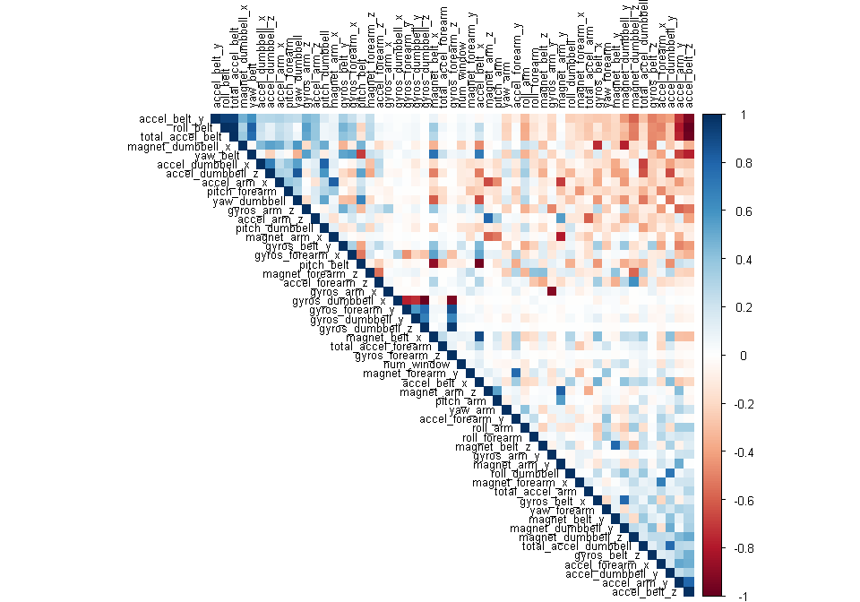
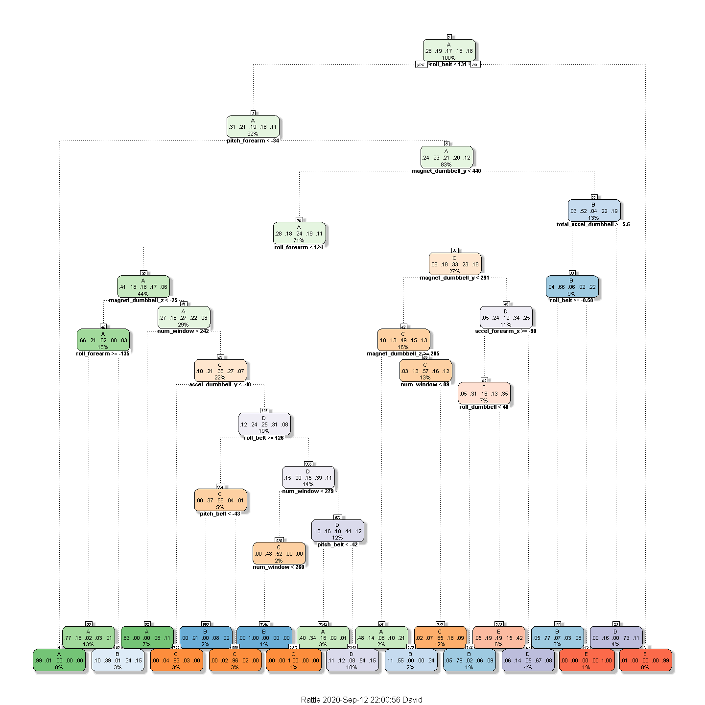
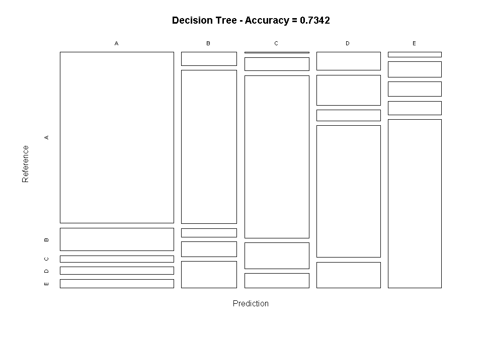
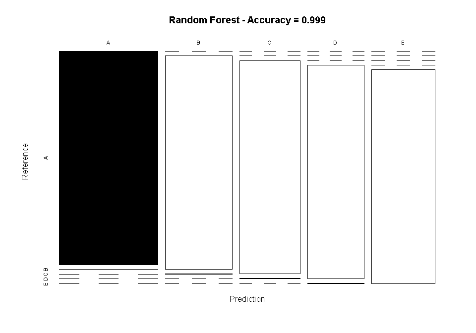

This document is the final report of the Peer Assessment project from
Coursera’s course Practical Machine Learning, as part of the
Specialization in Data Science.

Overview
========

Using devices such as Jawbone Up, Nike FuelBand, and Fitbit it is now
possible to collect a large amount of data about personal activity
relatively inexpensively. These type of devices are part of the
quantified self movement - a group of enthusiasts who take measurements
about themselves regularly to improve their health, to find patterns in
their behavior, or because they are tech geeks. One thing that people
regularly do is quantify how much of a particular activity they do, but
they rarely quantify how well they do it.

In this project, will be to use data from accelerometers on the belt,
forearm, arm, and dumbell of 6 participants. They were asked to perform
barbell lifts correctly and incorrectly in 5 different ways. More
information is available from the website here: [HUMAN ACTIVITY
RECOGNITION](http://groupware.les.inf.puc-rio.br/har) (see the section
on the Weight Lifting Exercise Dataset)

Authors: Velloso, E.; Bulling, A.; Gellersen, H.; Ugulino, W.; Fuks, H.
“Qualitative Activity Recognition of Weight Lifting Exercises.
Proceedings of 4th International Conference in Cooperation with SIGCHI
(Augmented Human ’13)”. Stuttgart, Germany: ACM SIGCHI, 2013

 

Exploratory data analyses
=========================

The training data for this project are available
[HERE](https://d396qusza40orc.cloudfront.net/predmachlearn/pml-training.csv)

The test data are available
[HERE](https://d396qusza40orc.cloudfront.net/predmachlearn/pml-testing.csv)

A short description of the datasets content from the authors’ website:

“Six young health participants were asked to perform one set of 10
repetitions of the Unilateral Dumbbell Biceps Curl in five different
fashions: exactly according to the specification (Class A), throwing the
elbows to the front (Class B), lifting the dumbbell only halfway (Class
C), lowering the dumbbell only halfway (Class D) and throwing the hips
to the front (Class E).

Class A corresponds to the specified execution of the exercise, while
the other 4 classes correspond to common mistakes. Participants were
supervised by an experienced weight lifter to make sure the execution
complied to the manner they were supposed to simulate. The exercises
were performed by six male participants aged between 20-28 years, with
little weight lifting experience. We made sure that all participants
could easily simulate the mistakes in a safe and controlled manner by
using a relatively light dumbbell (1.25kg)"

 

Loading libraries necessaries for the complete analysis

    library(knitr)
    library(caret)
    library(rpart)
    library(rpart.plot)
    library(rattle)
    library(randomForest)
    library(corrplot)
    library(gbm)
    library(e1071)
    set.seed(12345)

Data Loading and Cleaning
-------------------------

The next step is loading the dataset from the URL provided above. The
training dataset is then partitioned in 2 to create a Training set (70%
of the data) for the modeling process and a Test set (with the remaining
30%) for the validations. The testing dataset is not changed and will
only be used for the quiz results generation.

    # set the URL for the download
    UrlTrain <- "http://d396qusza40orc.cloudfront.net/predmachlearn/pml-training.csv"
    UrlTest  <- "http://d396qusza40orc.cloudfront.net/predmachlearn/pml-testing.csv"

    # download the datasets
    training <- read.csv(url(UrlTrain))
    testing  <- read.csv(url(UrlTest))

    # create a partition with the training dataset 
    inTrain  <- createDataPartition(training$classe, p = .7, list = FALSE)
    TrainSet <- training[inTrain, ]
    TestSet  <- training[-inTrain, ]
    dim1 <- dim(TrainSet)[1]
    dim(TrainSet)

    ## [1] 13737   160

    dim(TestSet)

    ## [1] 5885  160

Removing the variables that contains missing values

    trainData<- TrainSet[, colSums(is.na(TrainSet)) == 0]
    testData <- TestSet[, colSums(is.na(TestSet)) == 0]
    dim(trainData)

    ## [1] 13737    93

    dim(testData)

    ## [1] 5885   93

 

Cleaning even further by removing the variables that are
near-zero-variance

    NZV <- nearZeroVar(trainData)
    trainData <- trainData[, -NZV]
    testData  <- testData[, -NZV]
    dim(trainData)

    ## [1] 13737    59

    dim(testData)

    ## [1] 5885   59

 

    trainData <- trainData[, -(1:5)]
    testData  <- testData[, -(1:5)]
    dim(trainData)

    ## [1] 13737    54

    testData$classe <- as.factor(testData$classe)

 

Correlation Analysis
====================

First, a correlation among variables is analyzed before proceeding to
the modeling procedures

Fig. 1. Correlation plot, the highly correlated variables are shown in
dark colors in the graph above [Appendix 1.](#appendix1).

 

Use the ***findCorrelation*** function to search for highly correlated
attributes with a cut off equal to 0.75

    highlyCorrelated = findCorrelation(corMatrix, cutoff=0.75)

 

Then, obtain the names of highly correlated attributes

    names(trainData)[highlyCorrelated]

    ##  [1] "accel_belt_z"      "roll_belt"         "accel_belt_y"     
    ##  [4] "accel_arm_y"       "total_accel_belt"  "accel_dumbbell_z" 
    ##  [7] "accel_belt_x"      "pitch_belt"        "magnet_dumbbell_x"
    ## [10] "accel_dumbbell_y"  "magnet_dumbbell_y" "accel_dumbbell_x" 
    ## [13] "accel_arm_x"       "accel_arm_z"       "magnet_arm_y"     
    ## [16] "magnet_belt_z"     "accel_forearm_y"   "gyros_forearm_y"  
    ## [19] "gyros_dumbbell_x"  "gyros_dumbbell_z"  "gyros_arm_x"

Prediction Model Builiding
==========================

Three methods will be applied to model the regressions (in the Train
dataset) and the best one (with higher accuracy when applied to the Test
dataset) will be used for the quiz predictions. The methods are:
Decision Tree, Random Forests and Generalized Boosted Model, as
described below. A Confusion Matrix is plotted at the end of each
analysis to better visualize the accuracy of the models

Method: Decision Trees
----------------------

    set.seed(12345)
    modFitDecTree <- rpart(classe ~ ., data = trainData, method = "class")
    fancyRpartPlot(modFitDecTree, cex = .7)

 

Then, validate the model on the testData to find out how well it
performs by looking at the accuracy variable

    predictTreeMod1 <- predict(modFitDecTree, newdata=testData, type="class")
    cmtree <- confusionMatrix(predictTreeMod1, testData$classe)
    cmtree

    ## Confusion Matrix and Statistics
    ## 
    ##           Reference
    ## Prediction    A    B    C    D    E
    ##          A 1502  201   59   66   74
    ##          B   58  660   37   64  114
    ##          C    4   66  815  129   72
    ##          D   90  148   54  648  126
    ##          E   20   64   61   57  696
    ## 
    ## Overall Statistics
    ##                                           
    ##                Accuracy : 0.7342          
    ##                  95% CI : (0.7228, 0.7455)
    ##     No Information Rate : 0.2845          
    ##     P-Value [Acc > NIR] : < 2.2e-16       
    ##                                           
    ##                   Kappa : 0.6625          
    ##                                           
    ##  Mcnemar's Test P-Value : < 2.2e-16       
    ## 
    ## Statistics by Class:
    ## 
    ##                      Class: A Class: B Class: C Class: D Class: E
    ## Sensitivity            0.8973   0.5795   0.7943   0.6722   0.6433
    ## Specificity            0.9050   0.9425   0.9442   0.9151   0.9579
    ## Pos Pred Value         0.7897   0.7074   0.7505   0.6079   0.7751
    ## Neg Pred Value         0.9568   0.9033   0.9560   0.9344   0.9226
    ## Prevalence             0.2845   0.1935   0.1743   0.1638   0.1839
    ## Detection Rate         0.2552   0.1121   0.1385   0.1101   0.1183
    ## Detection Prevalence   0.3232   0.1585   0.1845   0.1811   0.1526
    ## Balanced Accuracy      0.9011   0.7610   0.8693   0.7936   0.8006

    DTaccuracy <- cmtree$overall[1]

    The accuracy from Decision Trees is 0.7342396

 

Plot matrix results

Fig. 2. Plot from Decision Trees model [Appendix 2.](#appendix2).

Method: Random Forest
---------------------

    set.seed(12345)
    controlRF <- trainControl(method = "cv", number = 3, verboseIter = FALSE)
    modFitRandForest <- train(classe ~ ., data=trainData, method = "rf",
                              trControl = controlRF)
    modFitRandForest$finalModel

    ## 
    ## Call:
    ##  randomForest(x = x, y = y, mtry = param$mtry) 
    ##                Type of random forest: classification
    ##                      Number of trees: 500
    ## No. of variables tried at each split: 27
    ## 
    ##         OOB estimate of  error rate: 0.23%
    ## Confusion matrix:
    ##      A    B    C    D    E  class.error
    ## A 3904    2    0    0    0 0.0005120328
    ## B    6 2647    4    1    0 0.0041384500
    ## C    0    5 2391    0    0 0.0020868114
    ## D    0    0    9 2243    0 0.0039964476
    ## E    0    0    0    5 2520 0.0019801980

 

Then, validate the model on the testData to find out how well it
performs by looking at the accuracy variable.

    predictRandForest <- predict(modFitRandForest, newdata = testData)
    confMatRandForest <- confusionMatrix(predictRandForest, testData$classe)
    RFaccuracy <- confMatRandForest$overall[1]

    The accuracy from Random Forest is 0.9989805

Fig. 3. Plot from Random Forest Model [Appendix 3.](#appendix3).

Method: Generalized Boosted Model
---------------------------------

    set.seed(12345)
    controlGBM <- trainControl(method = "repeatedcv", number = 5, repeats = 1)
    modFitGBM  <- train(classe ~ ., data = trainData, method = "gbm",
                        trControl = controlGBM, verbose = FALSE)
    modFitGBM$finalModel

    ## A gradient boosted model with multinomial loss function.
    ## 150 iterations were performed.
    ## There were 53 predictors of which 53 had non-zero influence.

 

Then, validate the model on the testData to find out how well it
performs by looking at the accuracy variable

    predictGBM <- predict(modFitGBM, newdata = testData)
    confMatGBM <- confusionMatrix(predictGBM, testData$classe)
    GBMaccuracy <- confMatGBM$overall[1]

    The accuracy from Generalized Boosted is 0.9870858

Fig. 4. Plot from Generalized Boosted Model [Appendix 4.](#appendix4)

 

    Finally, choose the best model from the accuracy value

    * Decision Tree: 0.7342396
    * Random Forest: 0.9989805
    * Generalized Boosted: 0.9870858

    In this case, the best model is Random Forest with 0.9989805 accuracy value

Applying the best model to the validation data
----------------------------------------------

By comparing the accuracy rate values of the three models, it is clear
the the Random Forest model is the higher value. So will use it on the
validation data and will be applied to predict the 20 quiz results
(testing dataset) as shown below

    Results <- predict(modFitRandForest, newdata = testing)
    Results[1:20]

    ##  [1] B A B A A E D B A A B C B A E E A B B B
    ## Levels: A B C D E

 

Appendix
========

Appendix 1

    corMatrix <- cor(trainData[, -54])
    corrplot(corMatrix, order = "FPC", method = "color", type = "upper", 
             tl.cex = 0.8, tl.col = rgb(0, 0, 0))

Appendix 2

    plot(cmtree$table, col = cmtree$byClass, 
         main = paste("Decision Tree - Accuracy =",
                      round(cmtree$overall['Accuracy'], 4)))

Appendix 3

    plot(confMatRandForest$table, col = confMatRandForest$byClass, 
         main = paste("Random Forest - Accuracy =",
                      round(confMatRandForest$overall['Accuracy'], 4)))

Appendix 4

    plot(confMatGBM$table, col = confMatGBM$byClass, 
         main = paste("GBM - Accuracy =", round(confMatGBM$overall['Accuracy'], 4)))
